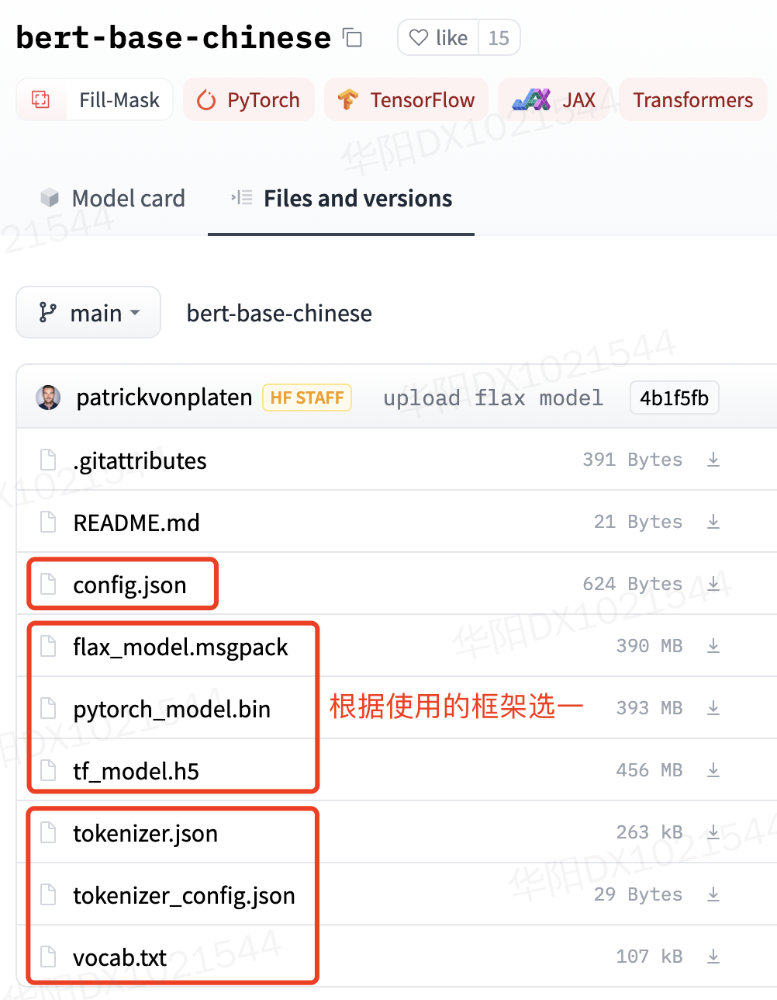

Transformers库使用记录
===

- Github: https://github.com/huggingface/transformers
- Doc: https://huggingface.co/transformers/installation.html
- Pretrained Models: https://huggingface.co/models

### 正常使用

```python
from transformers import AutoTokenizer, AutoModelForMaskedLM
  
tokenizer = AutoTokenizer.from_pretrained("bert-base-chinese")

model = AutoModelForMaskedLM.from_pretrained("bert-base-chinese")
```


### 离线使用（Offline 模式）
> https://huggingface.co/transformers/installation.html#offline-mode

- 首先从[模型站](https://huggingface.co/models)下载所需文件：

<div align="center"></div>

- 然后设置环境变量 `TRANSFORMERS_OFFLINE=1`
    - 可以在命令行中使用（推荐） ，如 `$ TRANSFORMERS_OFFLINE=1 python train.py`
    - 或者在代码中使用（需要放在导入 transformers 之前），如`os.environ['TRANSFORMERS_OFFLINE'] = '1'`

- 如果用到了同门的 `datasets` 库，还要加上 `HF_DATASETS_OFFLINE=1`；