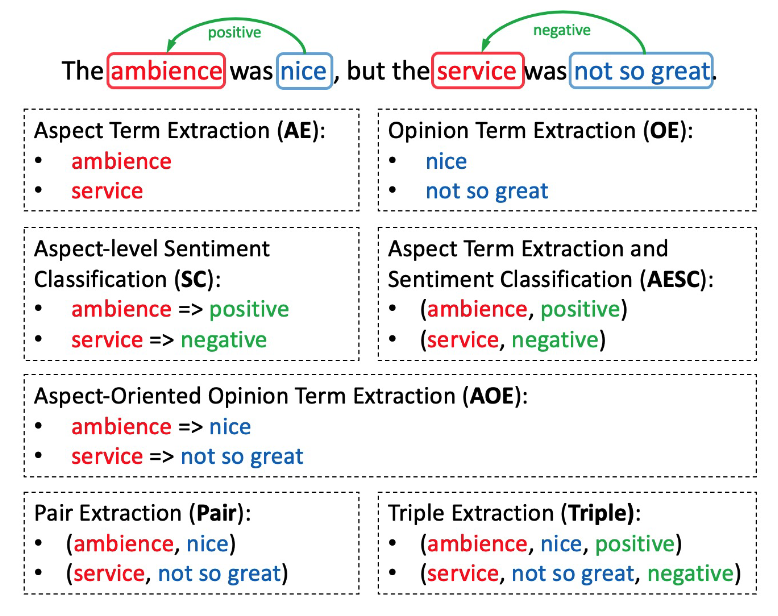
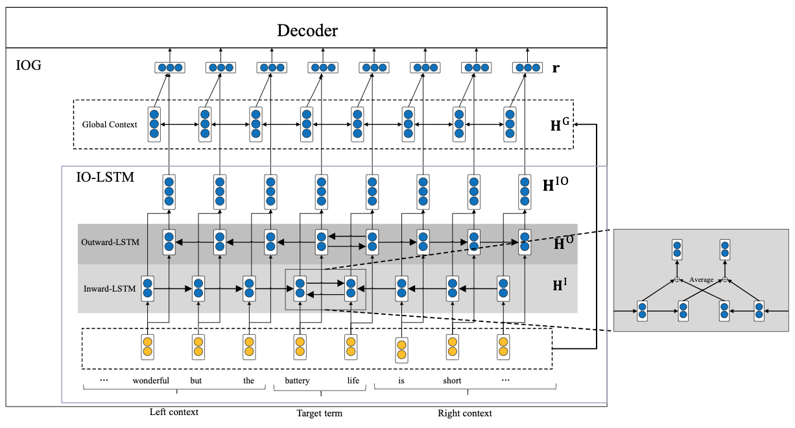

细粒度情感分析
===
> Aspect Based Sentiment Analysis(ABSA), Target Based Sentiment Analysi(TBSA), 
- Aspect 直译为“方面”，具体可以理解为意见指向的“目标（Target）”或“情感对象”；在一些场景下可以理解为“属性”、“维度”、“功能”等；

Index
---
<!-- TOC -->

- [任务描述](#任务描述)
- [论文简读](#论文简读)
    - [Target-oriented Opinion Words Extraction with Target-fused Neural Sequence Labeling](#target-oriented-opinion-words-extraction-with-target-fused-neural-sequence-labeling)
- [参考文献](#参考文献)

<!-- /TOC -->

## 任务描述

**相关子任务示例**$^{[1]}$

> 其中 "ambience/service" 为 Aspect Terms（AT），"nice/not so great" 为 Opinion Terms（OT）

- Aspect/Target Extraction、Opinion Target Extraction
    > 情感对象提取
- Opinion Extraction/Summarization
    > [意见/评价/观点/情感]提取/摘要
- Aspect Sentiment Classification
    > 情感分类（极性分类）
- Aspect-oriented Opinion Terms Extraction (AOE)
    > 提取给定 AT 的 OT
- Pair Extraction: 同时提取（Aspect, Opinion）
- Triple Extraction: 同时提取（Aspect, Opinion, Sentiment）

## 论文简读

### Target-oriented Opinion Words Extraction with Target-fused Neural Sequence Labeling
> https://www.aclweb.org/anthology/N19-1259/
- 目标：给定 AT，抽取 OT（Target-oriented Opinion Words Extraction）
- 难点：学习特定目标的上下文表示；
- 亮点：提出 Inward-Outward LSTM 结构来对 Target 的上下文进行建模 —— 一种针对特定目标的双向 LSTM，其结构如图（注意 LSTM 的方向）；

- 【Github, PyTorch】[NJUNLP/TOWE: Code and data for "Target-oriented Opinion Words Extraction with Target-fused Neural Sequence Labeling" (NAACL2019)](https://github.com/NJUNLP/TOWE)

## 参考文献
$[1]$ 【2021】[A Joint Training Dual-MRC Framework for Aspect Based Sentiment Analysis](https://arxiv.org/abs/2101.00816)  
$[2]$ 【2019】[细粒度情感分析（ABSA），一个从零开始的案例教程【Python实现】_HapHapYear的博客 - CSDN博客](https://blog.csdn.net/HapHapYear/article/details/101102870)  
$[3]$ 【2019, NAACL】[Target-oriented Opinion Words Extraction with Target-fused Neural Sequence Labeling](https://www.aclweb.org/anthology/N19-1259/)  