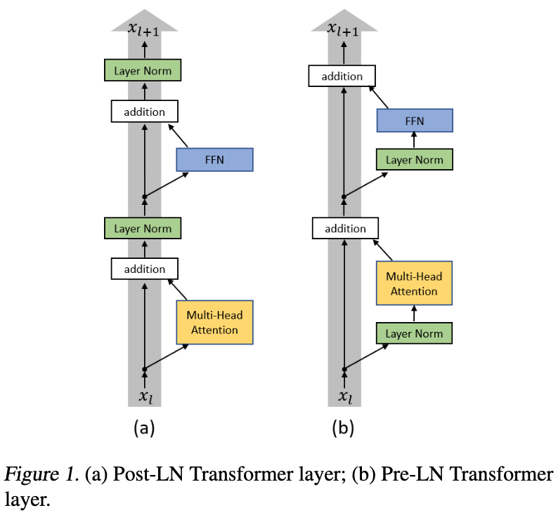

Transformer 模型族
===

Index
---
<!-- TOC -->

- [Transformer](#transformer)
    - [Transformer 改进](#transformer-改进)
- [BERT 相关](#bert-相关)
    - [BERT](#bert)
    - [RoBERTa](#roberta)
        - [中文 RoBERTa](#中文-roberta)
    - [SentenceBERT](#sentencebert)
    - [ConSERT](#consert)

<!-- /TOC -->

## Transformer
- 【2017】[Attention Is All You Need](https://arxiv.org/abs/1706.03762)
    > 提出 Transformer 结构

### Transformer 改进
- 【2020】[On Layer Normalization in the Transformer Architecture](https://arxiv.org/abs/2002.04745)
    > 分析了 PerLN 和 PostLN 的优缺点：
    > - PreLN 对梯度下降更友好，收敛更快，对超参数更鲁棒，但性能一般弱于 PostLN；
    > - PostLN 更难训练，需要从一个较小的学习率开始，配合预热（warm-up）进行训练；

- 【2020】[RealFormer: Transformer Likes Residual Attention](https://arxiv.org/abs/2012.11747)
    > 兼顾 PostLN 的性能和 PreLN 的稳定
    - 【解读】[RealFormer：把残差转移到Attention矩阵上面去 - 科学空间](https://kexue.fm/archives/8027)
- 【2020】[ReZero is All You Need: Fast Convergence at Large Depth](https://arxiv.org/abs/2003.04887)
    > 针对残差结构的优化：$x+f(x)$ → $x+αf(x)$，主要用于加速收敛，论文表明可以代替 Transformer 中的 LayerNorm 层
    - 【Github】[Official PyTorch Repo for "ReZero is All You Need: Fast Convergence at Large Depth"](https://github.com/majumderb/rezero)
- 实现
    - 【pytorch】[The Annotated Transformer](http://nlp.seas.harvard.edu/2018/04/03/attention.html)
        > 这里使用的是 PerLN，官方实现为 PostLN

## BERT 相关

### BERT
> 【2018、Google】[BERT: Pre-training of Deep Bidirectional Transformers for Language Understanding](https://arxiv.org/abs/1810.04805)

### RoBERTa
> 【2019、Facebook】[RoBERTa: A Robustly Optimized BERT Pretraining Approach](https://arxiv.org/abs/1907.11692)
>> 更好地训练 BERT 模型

**模型小结**
> [RoBERTa 详解 - 知乎](https://zhuanlan.zhihu.com/p/103205929)
- 模型结构与 BERT 相同（参数可以互用）；
- 动态 mask：每次将训练数据喂给模型时，才进行随机mask；
    > 静态 mask：将一个样本复制 `dupe_factor` 次，每次 mask 不同的 token；且不同的 mask 会输入不同的 epoch；
    >> 例：`dupe_factor=10`，`epoch=40`，则每种 mask 的方式在训练中会被使用4次。
- 以 Doc-Sentences 的方式构建语料，并移除 Next Sentence Prediction loss；
    > Doc-Sentences: 使用来自同一篇 doc 中的连续句子作为单个样本，总 token 数不超过 512；因为移除了 NSP 任务，所以也不需要以 pair 的方式输入语料；
    >> 论文比较了 4 种语料构建方式：1）Segment-Pair；2）Sentence-Pair；3）Full-Sentences；4）Doc-Sentences，详见原文；
- 优化器超参数调整；
- 更多训练数据、更大 batch size、更长训练时间；

#### 中文 RoBERTa
> [RoBERTa 中文预训练模型: RoBERTa for Chinese](https://github.com/brightmart/roberta_zh)
>> 没有实现动态 mask，而是通过增大样本复制数量（`dupe_factor`参数）达到类似的效果；

### SentenceBERT
> 【2019】[Sentence-BERT: Sentence Embeddings using Siamese BERT-Networks](https://arxiv.org/abs/1908.10084)
>> 句向量、孪生网络；语义相似度计算、聚类

**模型小结**
- 通过在 BERT 后添加 Pooling 层来产生固定维度的句向量； 
    > shape: `(?, 768, 512) -> (?, 512)`，详见 [sentence-transformers/Pooling.py](https://github.com/UKPLab/sentence-transformers/blob/master/sentence_transformers/models/Pooling.py)
    - 具体使用了三种 Pooling 方式：
        1. 直接使用 CLS 向量（the output of the CLS-token）；
        1. 所有 token embedding 的均值（不包含 CLS embedding，默认）；
        1. 所有 token embedding 的最大值（不包含 CLS embedding）
            > `torch.max(token_embeddings, dim=1)`，`dim=0` 为 batch 维
- 使用**孪生网络**和**自然语言推理**（NLI）数据来训练模型；
    - 具体使用的数据集为 SNLI 和 MultiNLI；
- 通过三种目标函数来 fine tune 模型，具体根据评估的数据集来确定；
    1. 分类任务，使用交叉熵 loss；
    1. 回归任务，计算两个句向量的 cosine 相似度，使用均方差 loss；
    1. Triplet Loss：输入是一个三元组 `(a, p, n)`，目标是拉近 `a, p` 的距离，拉远 `a, n` 的距离；
        > 详见 [Triplet loss](../机器学习/损失函数.md#Triplet-Loss)

**训练细节**
- 数据量：570,000 + 430,000 pairs
    > SNLI: 570,000、MultiNLI: 430,000
- 3-way softmax 分类；
- batch-size 16, epoch 1；
- Adam with lr=2e−5, a linear learning rate warm-up over 10% of the training data；

**应用**
> 

### ConSERT
> 【2021】[ConSERT: A Contrastive Framework for Self-Supervised Sentence Representation Transfer](https://arxiv.org/abs/2105.11741)
>> 句向量、无监督对比学习

>>【GitHub】[yym6472/ConSERT](https://github.com/yym6472/ConSERT)
