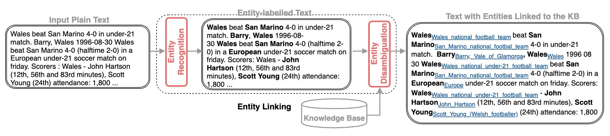

实体链接概述
===

Index
---
<!-- TOC -->

- [术语缩写](#术语缩写)
- [概览](#概览)
    - [任务描述](#任务描述)
    - [EL 的挑战](#el-的挑战)
- [基于深度学习的实体链接](#基于深度学习的实体链接)
- [参考文献](#参考文献)

<!-- /TOC -->

## 术语缩写

缩写 | 含义 
-----|-----
EL | 实体链接（Entity Linking, EL），也称实体链指
NER | 命名实体识别（Named Entity Recognition, NER），简称实体识别
NED | 命名实体消歧（Named Entity Disambiguation, NED），简称实体消歧
 

## 概览
- 实体链接一般流程：

- 如图$^{[1]}$，实体链接通常包含两个子任务：**实体识别**（NER）和**实体消歧**（NED），其中 NER 用于标识文本中的**mention**，NED 用于对 mention 消歧（判断 mention 与候选实体的相关性）；
    - 因为 NER 本身也是一个重要课题，所以很多文章中讨论的实体链接仅关注消歧部分，因此一些文章中的 NED 指的就是实体链接；
    - 一些基于深度学习的方法会将 NER 也纳入到整个训练过程，进行端到端的学习；
- 一般来说，<mention, entity> 的挖掘不会放到实体链接中来讨论；但是在现实任务中，这是个不能忽视的问题；

### 任务描述

**一般化描述**
- 简单来说，Entity Linking 是将非结构化文本中的 **mention**（提及），**链接**到结构化知识库中的**实体**（Entity）；
    > “提及”这个翻译不够直观，一般还是直接说 mention 比较多 ；

**形式化定义**
- 给定一个知识库 KB，其中包含一组实体 E，及其对应的 mention 集合 M；
- 其中每个实体 e 可能有多个 mention，同时每个 mention 也可能关联到多个实体（可以看做一个二部图）；
- 实体识别（ER）的过程可以描述为如下函数过程：输入一篇文档 $C$，输出所有可能的 mention 序列 $(m_1,m_2,...,m_n)$，记作 $ms$；

    $$ER(C) \rightarrow ms$$

- 实体消歧（ED）可描述为：输入 mention 序列 $ms$，及每个 mention 的上下文 $(c_1,c_2,...,c_n)$，记作 $cs$，输出每个 mention 链接到的实体 $(e_1,e_2,...,e_3)$，记作 $es$；

    $$ER(ms, cs) \rightarrow es$$

### EL 的挑战
- 知识库构建：mention 挖掘；
- 不可链接问题，NIL mention；
- **local** 链接和 **global** 链接问题；
    - local 只依赖局部上下文，global 则需要利用整篇文档来处理各 mention 之间的依存关系；

## 基于深度学习的实体链接
- 简单来说，神经实体链接（Neural Entity Linking, NEL）将 EL 看作是一个**分类任务**，其中实体对应到类别；
- 

## 参考文献
$[1]$. Neural Entity Linking: A Survey of ModelsBased on Deep Learning  

$[2]$. Entity Linking with a Knowledge Base: Issues, Techniques, and Solutions  
> 翻译：实体链接（一） - Pelhans 的博客 | http://pelhans.com/2019/08/16/kg_paper-note3/

