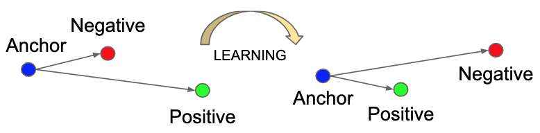

损失函数（Loss Function）
===
> 目标函数（Objective Function）

Index
---
<!-- TOC -->

- [Triplet Loss](#triplet-loss)

<!-- /TOC -->

### Triplet Loss
- 2015年在论文 [FaceNet](https://arxiv.org/abs/1503.03832) 中提出，用于生成可以更好衡量人脸相似度的 embedding；
- 效果示意图

    

    - 拉进 Anchor 与 Positive 的距离，拉远 Anchor 与 Negative 的距离，且两者距离的差大于 $\alpha$
- 公式：

    $$
    L = \max(\operatorname{d}(a,p) - \operatorname{d}(a,n) + \alpha, 0)
    $$

    等价于

    $$
    L = \operatorname{ReLU}(\operatorname{d}(a,p) - \operatorname{d}(a,n) + \alpha)
    $$
    
    - $\operatorname{d}(·,·)$ 为距离函数，常用有 cosine 距离、欧几里得距离、曼哈顿距离等；
        > 原本使用的是欧几里得距离
    - 参数 $\alpha$ 确保 $p$ 到 $a$ 的距离比 $n$ 到 $a$ 的距离近至少 $\alpha$ 那么多；
