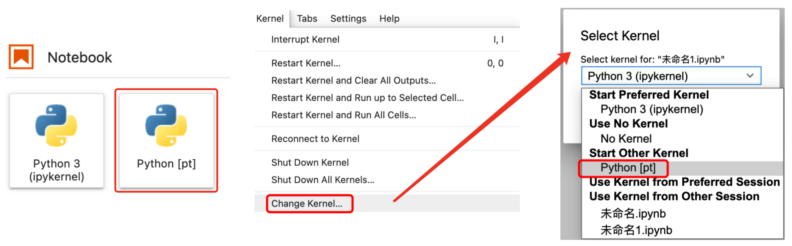

深度学习开发环境
===

<!-- TOC -->

- [pip 常用命令](#pip-常用命令)
    - [pip 换源](#pip-换源)
- [conda 常用命令](#conda-常用命令)
    - [conda 换源](#conda-换源)
    - [虚拟环境相关](#虚拟环境相关)
- [IPython 常用命令](#ipython-常用命令)
    - [自动加载](#自动加载)
- [Jupyter 常用命令](#jupyter-常用命令)
    - [自动加载模块](#自动加载模块)
    - [matplotlib 插入图片](#matplotlib-插入图片)
    - [在 中使用 tqdm](#在-中使用-tqdm)
    - [在 notebook 中选择环境](#在-notebook-中选择环境)
    - [远程 notebook](#远程-notebook)
    - [列出正在运行的 notebook](#列出正在运行的-notebook)
    - [结束某个的 notebook](#结束某个的-notebook)
- [TensorFlow 环境配置](#tensorflow-环境配置)
- [PyTorch 环境配置](#pytorch-环境配置)
- [PyCharm 常用配置](#pycharm-常用配置)
- [常见问题](#常见问题)
    - [pip 文件损坏](#pip-文件损坏)

<!-- /TOC -->


## pip 常用命令

### pip 换源
```shell
# 创建配置文件
## linux
mkdir ~/.pip
vim ~/.pip/pip.conf
## windows
%HOMEPATH%/pip/pip.ini

# 设置源
[global]
index-url = http://pypi.douban.com/simple
trusted-host = pypi.douban.com

# 常用源
## 阿里源
http://mirrors.aliyun.com/pypi/simple/
## 豆瓣源
http://pypi.douban.com/simple
## 清华源
https://pypi.tuna.tsinghua.edu.cn/simple
```


## conda 常用命令

### conda 换源
```shell
# 新增源
conda config --add channels https://mirrors.tuna.tsinghua.edu.cn/anaconda/pkgs/free/
conda config --set show_channel_urls yes

# 移除源
conda config --remove channels https://mirrors.tuna.tsinghua.edu.cn/anaconda/pkgs/free/

# 常用源
## 清华源
https://mirrors.tuna.tsinghua.edu.cn/anaconda/pkgs/free/
## USTC 源
https://mirrors.ustc.edu.cn/anaconda/pkgs/free/
```

### 虚拟环境相关

**激活/退出环境**
```shell
# window
activate $env_name/$path
# linux
source activate $env_name/$path

# 退出环境
conda deactivate
```

**创建环境**
```shell
# 创建环境
conda create -n $env_name python=3.8
conda create -n $env_name $pkg_name python=3
# 示例：conda create -n my anaconda python=3

# 指定目录创建环境（推荐）
conda create -p $path python=3.8
# 激活指定目录下的环境
source activate $path

# 克隆/备份环境
conda create --name dst --clone src

# 删除环境
conda remove --name myenv --all
```


## IPython 常用命令

### 自动加载
```
%load_ext autoreload
%autoreload 2
```


## Jupyter 常用命令

### 自动加载模块
``` 
%load_ext autoreload
%autoreload 2
```

### matplotlib 插入图片
```
%pylab inline
```

### 在 中使用 tqdm
```python
from tqdm.notebook import tqdm
```

### 在 notebook 中选择环境

**使用场景**：在 base 环境下启动 Jupyter，然后在 notebook 中切换环境，或创建 notebook 时选择指定环境；

**操作步骤**：

1. 切换到需要的环境：`source activate $env`
2. 安装 ipykernel（如果没有）：`conda install ipykernel`
3. 在当前环境下执行：`python -m ipykernel install --user --name $env --display-name "Python [$env]"`

**效果图**

<div align="center"><a href=""></a></div>


### 远程 notebook
1. 确定运行环境：`conda env list`
2. 在远程打开一个 notebook: `nohup jupyter lab --port={port} > log.txt &`；
3. 从 `log.txt` 查看 token: `vim log.txt`；
4. 查看远程服务器的 ip: `ifconfig`；
5. 本地打开：`http://{ip}:{port}/?token={token}`；

**如果以上操作无法远程打开，可能存在网络问题，待解决**

### 列出正在运行的 notebook
```
jupyter notebook list
```

### 结束某个的 notebook
- 法1）`ps -aux | grep jupyter` 找出该程序的 pid，然后 `kill -9 pid`；
- 法2）在 notebook 中：`File` -> `Shut Down`


## TensorFlow 环境配置
> [TensorFlow安装](https://www.tensorflow.org/install?hl=zh-cn)

## PyTorch 环境配置
1. `conda create -n torch anaconda python=3.x`
    > python 版本视 anaconda base 环境而定，避免重新下载依赖包
2. `conda install pytorch torchvision torchaudio cpuonly -c pytorch-lts`
    > 安装前至 [Start Locally | PyTorch](https://pytorch.org/get-started/locally/) 确认；
    >> 目前 Mac 暂不支持 LTS，可选 `conda install pytorch==1.8.0 torchvision==0.9.0 torchaudio==0.8.0 -c pytorch`
- 【可选】`conda install -c fastai -c pytorch fastai`
    > 不建议使用 pip 安装，版本落后
- 【可选】`pip install accelerate`
    > [huggingface/accelerate: A simple way to train and use PyTorch models with multi-GPU, TPU, mixed-precision](https://github.com/huggingface/accelerate)


## PyCharm 常用配置

- import 不折叠：`Code Folding -> Imports`
- 设置代码模板：`File and Code Templates`
    - python 模板
        ```python
        #!/usr/bin/env python
        # -*- coding:utf-8 -*-
        """
        Time: ${YEAR}-${MONTH}-${DAY} ${TIME}

        Author: huayang

        Subject:

        """
        import os
        import sys
        import json
        import doctest

        from typing import *      
        from collections import defaultdict


        def _test():
            """"""
            doctest.testmod()


        if __name__ == '__main__':
            """"""
            _test()
        ```

- 设置 Python Console 模板：`Python Console`
    ```python
    %load_ext autoreload
    %autoreload 2

    import os

    import numpy as np

    import torch
    import torch.nn as nn
    import torch.nn.functional as F

    # import tensorflow as tf
    ```

## 常见问题

### pip 文件损坏

- 错误提示 `ImportError: cannot import name 'InvalidSchemeCombination' from 'pip._internal.exceptions'`

**解决方法**
> https://blog.csdn.net/weixin_40040107/article/details/102581918

1. 执行 `python -m ensurepip --default-pip`
2. 下载 https://bootstrap.pypa.io/get-pip.py
3. 运行 `python get-pip.py`