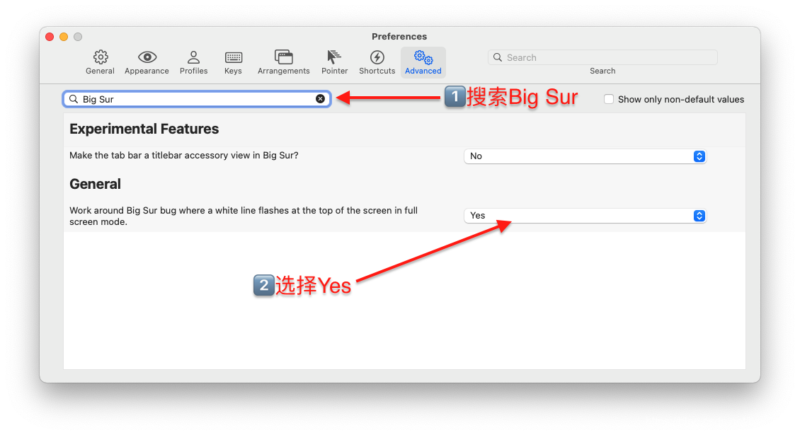
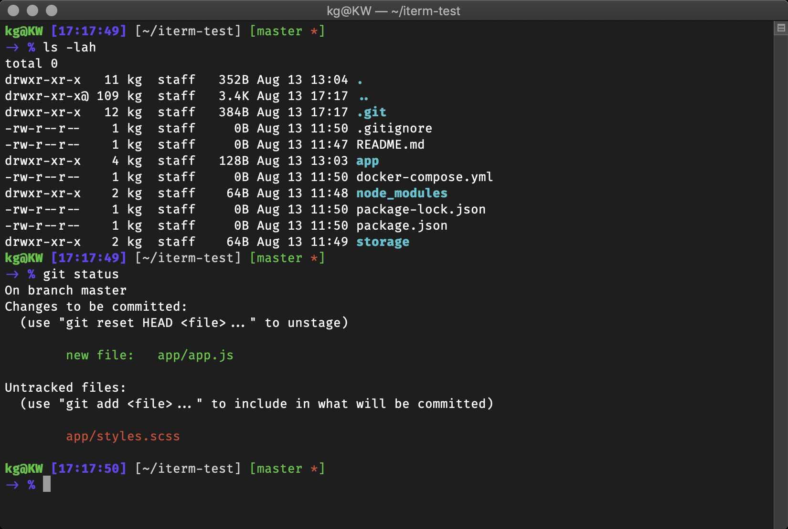

iTerm2 + zsh
===

<!-- TOC -->

- [iTerm2](#iterm2)
    - [常用快捷键](#常用快捷键)
    - [Tab 栏位置调整](#tab-栏位置调整)
    - [常见问题](#常见问题)
        - [最大化后顶部白线](#最大化后顶部白线)
- [zsh](#zsh)
    - [主题样式](#主题样式)
- [常用操作](#常用操作)

<!-- /TOC -->

## iTerm2

### 常用快捷键
- 分屏：`command + D`
- 分 tab：`command + T`

### Tab 栏位置调整
-  Preferences -> Appearance -> Tab bar location -> Left

### 常见问题
#### 最大化后顶部白线

## zsh

### 主题样式
> https://github.com/ohmyzsh/ohmyzsh/wiki/Themes

**更换主题**
- 打开文件 `~/.zshrc`，修改 `ZSH_THEME` 的值；
- 推荐主题：candy

## 常用操作